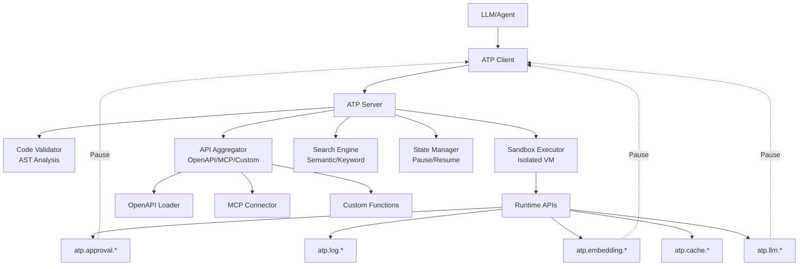

# Agent Tool Protocol

A production-ready, code-first protocol for AI agents to interact with external systems through secure sandboxed code execution.

## 🌟 Key Features

- **Code-First Approach**: LLMs generate TypeScript/JavaScript code instead of JSON function calls
- **Production Security**: Isolated VM sandboxing with memory limits, timeouts, and provenance tracking
- **OpenAPI Native**: Convert any OpenAPI spec to executable functions automatically
- **MCP Compatible**: Connect to multiple MCP servers and aggregate their tools
- **Semantic Search**: Intelligent API discovery with optional embedding-based search
- **LLM Callbacks**: Client-side LLM execution with pause/resume support
- **Approval Workflows**: Human-in-the-loop via LangGraph interrupts and checkpoints
- **Type Safety**: Full TypeScript support with generated type definitions
- **Runtime APIs**: Built-in `atp.*` APIs for LLM, embeddings, approvals, caching, logging
- **Easy Integration**: Works with LangChain, LangGraph, and existing MCP infrastructure

## 🚀 Why Code-First?

Traditional function-calling protocols like MCP have limitations:

- **Context Bloat**: Large schemas consume tokens
- **Sequential Execution**: Only one tool at a time
- **No Filtering**: Can't process or combine results
- **Limited Models**: Not all LLMs support function calling well

**Agent Tool Protocol solves this** by letting LLMs write code that:

- ✅ Executes multiple operations in parallel
- ✅ Filters and transforms data
- ✅ Chains operations together
- ✅ Uses familiar programming patterns
- ✅ Works with any LLM that can generate code

## 📦 Installation

```bash
# Using Yarn (recommended)
yarn add @agent-tool-protocol/server @agent-tool-protocol/client

# Using npm
npm install @agent-tool-protocol/server @agent-tool-protocol/client
```
> **📝 Note:** The `--no-node-snapshot` flag is required for Node.js 20+
## 🎯 Quick Start

### Quickstart Example

A single script that integrates OpenAPI (Petstore) and MCP (Playwright):

```typescript
import { createServer, loadOpenAPI } from '@agent-tool-protocol/server';
import { AgentToolProtocolClient } from '@agent-tool-protocol/client';
import { MCPConnector } from '@agent-tool-protocol/mcp-adapter';

process.env.ATP_JWT_SECRET = process.env.ATP_JWT_SECRET || 'test-secret-key';

async function main() {
	const server = createServer({});

	// Load OpenAPI spec (supports OpenAPI 3.0+ and Swagger 2.0)
	const petstore = await loadOpenAPI(
		'https://petstore.swagger.io/v2/swagger.json',
		{ name: 'petstore', filter: { methods: ['GET'] } }
	);

	// Connect to MCP server
	const mcpConnector = new MCPConnector();
	const playwright = await mcpConnector.connectToMCPServer({
		name: 'playwright',
		command: 'npx',
		args: ['@playwright/mcp@latest'],
	});

	server.use([petstore, playwright]);
	await server.listen(3333);

	// Create client and execute code
	const client = new AgentToolProtocolClient({
		baseUrl: 'http://localhost:3333',
	});
	await client.init({ name: 'quickstart', version: '1.0.0' });

	// Execute code that filters, maps, and transforms API data
	const result = await client.execute(`
		const pets = await api.petstore.findPetsByStatus({ status: 'available' });
		
		const categories = pets
			.filter(p => p.category?.name)
			.map(p => p.category.name)
			.filter((v, i, a) => a.indexOf(v) === i);
		
		return {
			totalPets: pets.length,
			categories: categories.slice(0, 5),
			sample: pets.slice(0, 3).map(p => ({
				name: p.name,
				status: p.status
			}))
		};
	`);

	console.log('Result:', JSON.stringify(result.result, null, 2));
}

main().catch(console.error);
```

**Run it:**

```bash
cd examples/quickstart
NODE_OPTIONS='--no-node-snapshot' npm start
```


### LangChain Agent Example

Use ATP with LangChain/LangGraph for autonomous agents:

```typescript
import { createServer, loadOpenAPI } from '@agent-tool-protocol/server';
import { ChatOpenAI } from '@langchain/openai';
import { createReactAgent } from '@langchain/langgraph/prebuilt';
import { createATPTools } from '@agent-tool-protocol/langchain';


async function main() {
	// Start ATP server with OpenAPI
	const server = createServer({});
	const petstore = await loadOpenAPI(
		'https://petstore.swagger.io/v2/swagger.json',
		{ name: 'petstore', filter: { methods: ['GET'] } }
	);
	server.use([petstore]);
	await server.listen(3333);

	// Create LangChain agent with ATP tools
	const llm = new ChatOpenAI({ modelName: 'gpt-4o-mini', temperature: 0 });
	const { tools } = await createATPTools({
		serverUrl: 'http://localhost:3333',
		llm,
	});
	const agent = createReactAgent({ llm, tools });

	// Agent autonomously uses ATP to call APIs
	const result = await agent.invoke({
		messages: [
			{
				role: 'user',
				content:
					'Use ATP to fetch available pets from the petstore API, then tell me how many pets are available and list 3 example pet names.',
			},
		],
	});

	console.log('Agent response:', result.messages[result.messages.length - 1].content);
}

main().catch(console.error);
```

**Run it:**

```bash
cd examples/langchain-quickstart
export OPENAI_API_KEY=sk-...
NODE_OPTIONS='--no-node-snapshot' npm start
```

> **📝 Note:** The `--no-node-snapshot` flag is required for Node.js 20+ and is already configured in the `package.json`.

## 🧠 Advanced LangChain Features

### LLM Callbacks & Approval Workflows

ATP provides powerful LangChain/LangGraph integration with LLM callbacks and approval workflows:

```typescript
import { MemorySaver } from '@langchain/langgraph';
import { createATPTools } from '@agent-tool-protocol/langchain';
import { ChatOpenAI } from '@langchain/openai';

const llm = new ChatOpenAI({ modelName: 'gpt-4.1' });

// Create ATP tools with LLM support and LangGraph interrupt-based approvals
const { tools, isApprovalRequired, resumeWithApproval } = await createATPTools({
	serverUrl: 'http://localhost:3333',
	llm,
	// useLangGraphInterrupts: true (default) - use LangGraph checkpoints for async approvals
});

const checkpointer = new MemorySaver();
const agent = createReactAgent({ llm, tools, checkpointSaver: checkpointer });

try {
	await agent.invoke({ messages: [...] }, { configurable: { thread_id: 'thread-1' } });
} catch (error) {
	if (isApprovalRequired(error)) {
		const { executionId, message } = error.approvalRequest;

		// Notify user (Slack, email, etc.)
		await notifyUser(message);

		// Wait for approval (async - can take hours/days)
		const approved = await waitForApproval(executionId);

		// Resume execution
		const result = await resumeWithApproval(executionId, approved);
	}
}

// Alternative: Simple synchronous approval handler
const { tools } = await createATPTools({
  serverUrl: 'http://localhost:3333',
  llm,
  useLangGraphInterrupts: false,  // Required for approvalHandler
  approvalHandler: async (message, context) => {
    console.log('Approval requested:', message);
    return true; // or false to deny
  },
});
```

## 📚 Runtime APIs (atp.\*)

Agents executing code have access to powerful runtime APIs:

### atp.llm.\*

Client-side LLM execution (requires `client.provideLLM()`):

```typescript
// Simple LLM call
const response = await atp.llm.call({
	prompt: 'What is the capital of France?',
	temperature: 0.7,
});

// Extract structured data
const user = await atp.llm.extract({
	prompt: 'Extract: John Doe, john@example.com',
	schema: {
		type: 'object',
		properties: {
			name: { type: 'string' },
			email: { type: 'string' },
		},
	},
});

// Classify text
const category = await atp.llm.classify({
	text: 'This is amazing!',
	categories: ['positive', 'negative', 'neutral'],
});
```

### atp.embedding.\*

Semantic search with embeddings (requires `client.provideEmbedding()`):

```typescript
// Store embedding
const id = await atp.embedding.embed('Important document');

// Search by similarity
const results = await atp.embedding.search('similar documents', {
	topK: 5,
	minSimilarity: 0.7,
});
```

### atp.approval.\*

Human-in-the-loop approvals (requires `client.provideApproval()`):

```typescript
const result = await atp.approval.request('Delete all user data?', { critical: true });

if (result.approved) {
	await deleteData();
}
```

### atp.cache.\*

Caching with TTL:

```typescript
await atp.cache.set('key', value, 3600); // TTL in seconds
const cached = await atp.cache.get('key');
```

### atp.log.\*

Structured logging:

```typescript
atp.log.info('User logged in', { userId: '123' });
atp.log.error('Failed to connect', { error });
```

### atp.progress.\*

Progress reporting:

```typescript
atp.progress.report({
	current: 5,
	total: 10,
	message: 'Processing items...',
});
```

### atp.api.\*

Dynamic APIs from OpenAPI, MCP, or custom functions:

```typescript
// OpenAPI
await atp.api.github.repos.get({ owner: 'user', repo: 'repo' });

// MCP
await atp.api.filesystem.read_file({ path: 'README.md' });

// Custom
await atp.api.database.createUser({ name: 'Alice' });
```

## 🛡️ Security Features

### Sandboxed Execution

- **Isolated VM**: Code runs in true V8 isolates with separate heaps
- **No Node.js Access**: Zero access to fs, net, child_process, etc.
- **Memory Limits**: Hard memory limits enforced at VM level
- **Timeout Protection**: Automatic termination after timeout
- **Code Validation**: AST analysis and forbidden pattern detection

### Provenance Security

Defend against prompt injection with provenance tracking:

```typescript
import { createServer, ProvenanceMode } from '@agent-tool-protocol/server';
import { preventDataExfiltration, requireUserOrigin } from '@agent-tool-protocol/server';

const server = createServer({
	execution: {
		provenanceMode: ProvenanceMode.PROXY, // or AST
		securityPolicies: [
			preventDataExfiltration, // Block data exfiltration
			requireUserOrigin, // Require user-originated data
		],
	},
});
```

### Runtime Controls

- **LLM Call Limits**: Configurable max LLM calls per execution
- **Rate Limiting**: Requests per minute and executions per hour
- **API Key Authentication**: Optional API key requirement
- **Audit Logging**: All executions logged for compliance

## 📊 Architecture



## 🏗️ Packages

```
@agent-tool-protocol/
├── protocol          # Core types and interfaces
├── server            # ATP server implementation
├── client            # Client SDK
├── runtime           # Runtime APIs (atp.*)
├── mcp-adapter       # MCP integration
├── langchain         # LangChain/LangGraph integration
├── atp-compiler      # Loop transformation and optimization
├── providers         # Cache, auth, OAuth, audit providers
└── provenance        # Provenance security (CAMEL-inspired)
```

## 🔍 API Discovery

### Search APIs

```typescript
const client = new AgentToolProtocolClient({ baseUrl, headers });

// Semantic search (requires embeddings)
const results = await client.searchQuery('How do I create a user?');

// Keyword search
const results = await client.search({
	query: 'create user',
	limit: 10,
});

// Explore all APIs
const schema = await client.explore();
```

### Type Definitions

```typescript
const types = await client.getTypeDefinitions();
// Returns TypeScript definitions for all atp.* APIs
```

## ⚙️ Configuration

Full server configuration:

```typescript
import { createServer } from '@agent-tool-protocol/server';
import { RedisCache, JSONLAuditSink } from '@agent-tool-protocol/providers';

const server = createServer({
  execution: {
    timeout: 30000,              // 30 seconds
    memory: 128 * 1024 * 1024,   // 128 MB
    llmCalls: 10,                // Max LLM calls per execution
    provenanceMode: 'proxy',     // Provenance tracking mode
    securityPolicies: [...],     // Security policies
  },

  clientInit: {
    tokenTTL: 3600,              // 1 hour
    tokenRotation: 1800,         // 30 minutes
  },

  executionState: {
    ttl: 3600,                   // State TTL in seconds
    maxPauseDuration: 3600,      // Max pause duration
  },

  discovery: {
    embeddings: embeddingsModel, // Enable semantic search
  },

  audit: {
    enabled: true,
    sinks: [
      new JSONLAuditSink({ path: './logs', rotateDaily: true }),
    ],
  },

  otel: {
    enabled: true,
    serviceName: 'atp-server',
    traceEndpoint: 'http://localhost:4318/v1/traces',
  },
});

// Add providers
server.setCacheProvider(new RedisCache({ redis }));
server.setAuthProvider(authProvider);

await server.start(3333);
```

## 🚀 Production Features

### Redis Cache

```typescript
import { RedisCache } from '@agent-tool-protocol/providers';
import Redis from 'ioredis';

const redis = new Redis(process.env.REDIS_URL);
server.setCacheProvider(new RedisCache({ redis }));
```

### Audit Logging

```typescript
import { JSONLAuditSink } from '@agent-tool-protocol/providers';

const server = createServer({
	audit: {
		enabled: true,
		sinks: [new JSONLAuditSink({ path: './audit-logs', rotateDaily: true })],
	},
});
```

### OpenTelemetry

```typescript
const server = createServer({
	otel: {
		enabled: true,
		serviceName: 'atp-server',
		traceEndpoint: 'http://localhost:4318/v1/traces',
		metricsEndpoint: 'http://localhost:4318/v1/metrics',
	},
});
```

### OAuth Integration

```typescript
import { GoogleOAuthProvider } from '@agent-tool-protocol/providers';

const oauthProvider = new GoogleOAuthProvider({
  clientId: process.env.GOOGLE_CLIENT_ID,
  clientSecret: process.env.GOOGLE_CLIENT_SECRET,
  redirectUri: 'http://localhost:3333/oauth/callback',
  scopes: ['https://www.googleapis.com/auth/calendar'],
});

server.addAPIGroup({
  name: 'calendar',
  type: 'oauth',
  oauthProvider,
  functions: [...],
});
```

## 📚 Documentation

- **[Getting Started](./docs/getting-started.md)** - Comprehensive guide
- **[Protocol Specification](./docs/protocol-spec.md)** - Complete protocol design
- **[API Reference](./docs/api-reference.md)** - Detailed API documentation
- **[Security Guide](./docs/provenance-security-guide.md)** - Security best practices
- **[LangChain Integration](./docs/framework-integration.md)** - LangChain/LangGraph guide
- **[Examples](./examples/)** - Working examples

## 🧪 Examples

All examples are self-contained and work end-to-end without external servers.

> **📝 Note:** Node.js 20+ requires the `--no-node-snapshot` flag. This is already configured in each example's `package.json` scripts, so just run `npm start`.

### 1. Quickstart - OpenAPI + MCP

Complete example with OpenAPI (Petstore) and MCP (Playwright) integration.

```bash
cd examples/quickstart
NODE_OPTIONS='--no-node-snapshot' npm start
```

**Environment variables:**
- `ATP_JWT_SECRET` - Optional (defaults to `test-secret-key` in code)

### 2. LangChain Agent

Autonomous LangChain agent using ATP to interact with APIs.

```bash
cd examples/langchain-quickstart
export OPENAI_API_KEY=sk-...
NODE_OPTIONS='--no-node-snapshot' npm start 
```

**Environment variables:**
- `OPENAI_API_KEY` - **Required**: Your OpenAI API key
- `ATP_JWT_SECRET` - Optional (defaults to `test-secret-key` in code)

### 3. LangChain React Agent

Advanced LangChain agent with the test server.

```bash
# Start test server
cd examples/test-server
npx tsx server.ts

# Run agent
cd examples/langchain-react-agent
export OPENAI_API_KEY=sk-...
npm start
```

**Environment variables:**
- `OPENAI_API_KEY` - Required: Your OpenAI API key

### 4. Additional Examples

Other examples in the `examples/` directory:
- `openapi-example` - OpenAPI integration examples
- `oauth-example` - OAuth flow examples
- `production-example` - Production configuration examples

## 🚢 Development

```bash
# Clone repository
git clone https://github.com/yourusername/agent-tool-protocol.git
cd agent-tool-protocol

# Install dependencies (Node.js 18+)
yarn install

# Build all packages
yarn build

# Run tests
yarn test

# Run E2E tests
yarn test:e2e

# Lint
yarn lint
```

## 📦 Requirements

### Node.js Version


### Compiler Setup (for isolated-vm)

`isolated-vm` requires native compilation:

- **macOS**: `xcode-select --install`
- **Ubuntu/Debian**: `sudo apt-get install python3 g++ build-essential`
- **Windows**: See [node-gyp Windows instructions](https://github.com/nodejs/node-gyp#on-windows)

## 📄 License

This project is licensed under the MIT License - see the [License](./LICENSE) file for details.

## 🙏 Acknowledgments

- Inspired by [Model Context Protocol (MCP)](https://github.com/modelcontextprotocol)
- Provenance security based on Google Research's [CAMEL paper](https://arxiv.org/abs/2410.02904)
- Sandboxing powered by [isolated-vm](https://github.com/laverdet/isolated-vm)
- LangChain integration via [@langchain/core](https://github.com/langchain-ai/langchainjs)

## 🔗 Links

- **Documentation**: [docs/](https://agenttoolprotocol.com/docs)
- **Examples**: [examples/](./examples/)
- **Package READMEs**: [packages/](./packages/)

---

**Built with ❤️ for the AI community**
