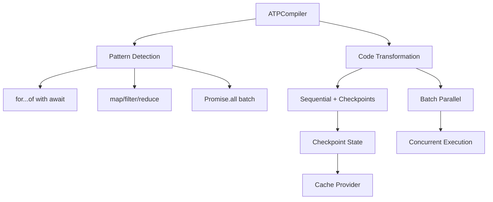

# @mondaydotcomorg/atp-compiler

Production-ready compiler for transforming async iteration patterns into resumable operations with checkpoint-based state management.

## Overview

The ATP compiler automatically transforms async loops and array methods into resumable operations, enabling true pause/resume from any iteration point. Includes batch parallel execution optimization for 100x speedups on concurrent operations.

## Installation

```bash
npm install @mondaydotcomorg/atp-compiler
```

## Architecture



## Features

- **Automatic transformation** of async loops and array methods
- **Batch parallel execution** for concurrent LLM/approval requests (up to 100x faster)
- **Checkpoint-based state** for true pause/resume from any iteration
- **Zero syntax changes** - works with standard JavaScript/TypeScript
- **Production-ready** with extensive testing and error handling

## Quick Start

```typescript
import { ATPCompiler, initializeRuntime } from '@mondaydotcomorg/atp-compiler';
import { cacheProvider } from '@mondaydotcomorg/atp-protocol';

// Initialize runtime
initializeRuntime({
	executionId: 'exec-123',
	cache: cacheProvider,
});

// Create compiler
const compiler = new ATPCompiler({
	enableBatchParallel: true,
});

// Transform code
const userCode = `
  const items = [1, 2, 3, 4, 5];
  const results = [];
  
  for (const item of items) {
    const response = await atp.llm.call({ prompt: \`Process \${item}\` });
    results.push(response);
  }
  
  return results;
`;

const result = compiler.transform(userCode);
// result.code now contains resumable version
```

## Batch Optimization

The compiler automatically detects simple patterns and optimizes for **batch parallel execution** - achieving up to **100x speedup**!

### Automatic Batching

```typescript
// Your code (no changes needed):
const results = await items.map(async (item) => {
	return await atp.llm.call({ prompt: item });
});

// ✅ Automatically batched! All LLM calls execute in parallel
// 🚀 100 items = ~2 seconds instead of ~200 seconds
```

### Complex Patterns = Sequential

```typescript
const results = await items.map(async (item) => {
	if (item.priority > 5) {
		// ← Conditional = sequential
		return await atp.llm.call({ prompt: item });
	}
});

// ✅ Still fully resumable with checkpoints
// Sequential execution with state saving
```

## Supported Patterns

### For Loops

```typescript
// Original code
for (const item of items) {
	await atp.llm.call({ prompt: item });
}

// Automatically transformed to resumable version
// Pauses can occur during iteration and resume from exact point
```

### Array Methods

```typescript
// map, forEach, filter, reduce, find, some, every, flatMap
const results = await items.map(async (item) => {
	return await atp.llm.call({ prompt: item });
});

// Each iteration checkpointed - resumes from where it paused
```

### Batch Parallel

```typescript
// Original code
const results = await Promise.all([
	atp.llm.call({ prompt: 'Q1' }),
	atp.llm.call({ prompt: 'Q2' }),
	atp.llm.call({ prompt: 'Q3' }),
]);

// All 3 LLM calls execute concurrently on client
// 3x faster than sequential execution
```

## API Reference

### ATPCompiler

```typescript
const compiler = new ATPCompiler({
	enableBatchParallel: true, // Enable batch parallel execution
	maxLoopNesting: 10, // Maximum loop nesting depth
	debugMode: false, // Enable debug logging
});

// Detect if code needs transformation
const detection = compiler.detect(code);
// { needsTransform: true, patterns: ['for-of-await', 'map-async'] }

// Transform code
const result = compiler.transform(code);
// { code: string, transformed: boolean, patterns: [], metadata: {...} }
```

### Runtime Initialization

```typescript
import { initializeRuntime } from '@mondaydotcomorg/atp-compiler';

initializeRuntime({
	executionId: 'unique-exec-id',
	cache: cacheProvider,
	checkpointPrefix: 'checkpoint', // Optional prefix for cache keys
});
```

## Checkpoint System

The compiler uses checkpoints to save loop state:

- **Every iteration** is checkpointed
- **State includes**: current index, results, accumulator
- **TTL**: 1 hour (configurable via cache provider)
- **Storage**: Uses ATP cache provider (Redis recommended)

```typescript
// Checkpoint structure
interface Checkpoint {
	index: number;
	results: unknown[];
	accumulator?: unknown;
	timestamp: number;
}
```

## Batch Parallel Execution

When enabled, direct pausable calls in `Promise.all` execute concurrently:

```typescript
// ✅ Batchable (all pausable calls are direct)
await Promise.all([atp.llm.call({ prompt: 'Q1' }), atp.llm.call({ prompt: 'Q2' })]);

// ❌ Not batchable (complex logic, falls back to sequential)
await Promise.all(
	items.map(async (item) => {
		const step1 = await atp.llm.call({ prompt: item });
		return await process(step1);
	})
);
```

## Performance Comparison

| Pattern                     | Without Compiler | With Compiler        | Speedup  |
| --------------------------- | ---------------- | -------------------- | -------- |
| Sequential loop (100 items) | 200s             | 200s + checkpointing | ~200s    |
| Batch parallel (100 items)  | 200s             | 2s                   | **100x** |
| Promise.all (10 items)      | 20s              | 2s                   | **10x**  |

## Error Handling

```typescript
import {
	isBatchPauseError,
	isCheckpointError,
	isTransformationError,
} from '@mondaydotcomorg/atp-compiler';

try {
	const result = compiler.transform(code);
} catch (error) {
	if (isTransformationError(error)) {
		console.error('Transformation failed:', error.message);
		console.error('Pattern:', error.pattern);
		console.error('Location:', error.location);
	}
}
```

## Limitations

**Not supported:**

- Recursive functions with await
- `for await...of` with async iterators
- Dynamic code generation (eval, new Function)
- Non-serializable objects in checkpoints

**Supported:**

- All standard array methods with async callbacks
- Nested loops up to 10 levels
- Try/catch around iterations
- Break/continue statements
- Early returns

## Integration with ATP Server

```typescript
// In executor.ts
import { ATPCompiler, initializeRuntime } from '@mondaydotcomorg/atp-compiler';

const compiler = new ATPCompiler();

// Before execution
if (cacheProvider) {
	initializeRuntime({
		executionId,
		cache: cacheProvider,
	});

	const detection = compiler.detect(code);
	if (detection.needsTransform) {
		const transformed = compiler.transform(code);
		codeToExecute = transformed.code;
	}
}
```

## Example: Transform and Execute

```typescript
import { ATPCompiler, initializeRuntime } from '@mondaydotcomorg/atp-compiler';
import { RedisCache } from '@agent-tool-protocol/providers';
import Redis from 'ioredis';

const redis = new Redis();
const cache = new RedisCache({ redis });

const compiler = new ATPCompiler({
	enableBatchParallel: true,
});

// User code
const code = `
  const urls = [
    'https://api.example.com/users/1',
    'https://api.example.com/users/2',
    'https://api.example.com/users/3',
  ];
  
  const users = await Promise.all(
    urls.map(url => atp.llm.call({ prompt: 'Summarize: ' + url }))
  );
  
  return users;
`;

// Initialize runtime
initializeRuntime({
	executionId: 'exec-456',
	cache,
});

// Transform
const result = compiler.transform(code);

// Execute (with ATP server)
const executionResult = await executor.execute(result.code);
// All 3 LLM calls execute in parallel! ⚡
```

## Transformation Examples

### Before (Sequential)

```typescript
const items = ['a', 'b', 'c'];
const results = [];

for (const item of items) {
	const response = await atp.llm.call({ prompt: item });
	results.push(response);
}
```

### After (Resumable)

```typescript
const items = ['a', 'b', 'c'];
const results = [];
const checkpointKey = 'checkpoint:exec-123:loop-1';

let startIndex = 0;
const checkpoint = await cache.get(checkpointKey);
if (checkpoint) {
	startIndex = checkpoint.index;
	results.push(...checkpoint.results);
}

for (let i = startIndex; i < items.length; i++) {
	const item = items[i];
	const response = await atp.llm.call({ prompt: item });
	results.push(response);

	// Save checkpoint
	await cache.set(checkpointKey, { index: i + 1, results }, 3600);
}
```

## Testing

```bash
# Run tests
npm test

# Watch mode
npm run test:watch

# Coverage
npm run test:coverage
```

## TypeScript Support

Full TypeScript definitions with strict typing.

## License

MIT
