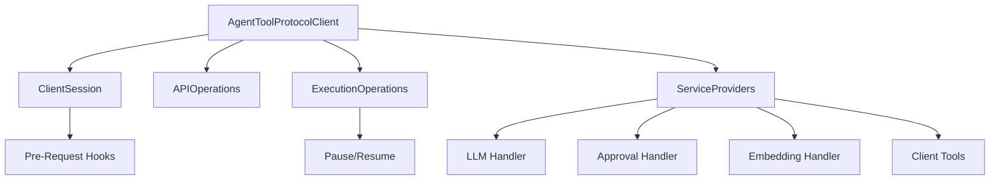
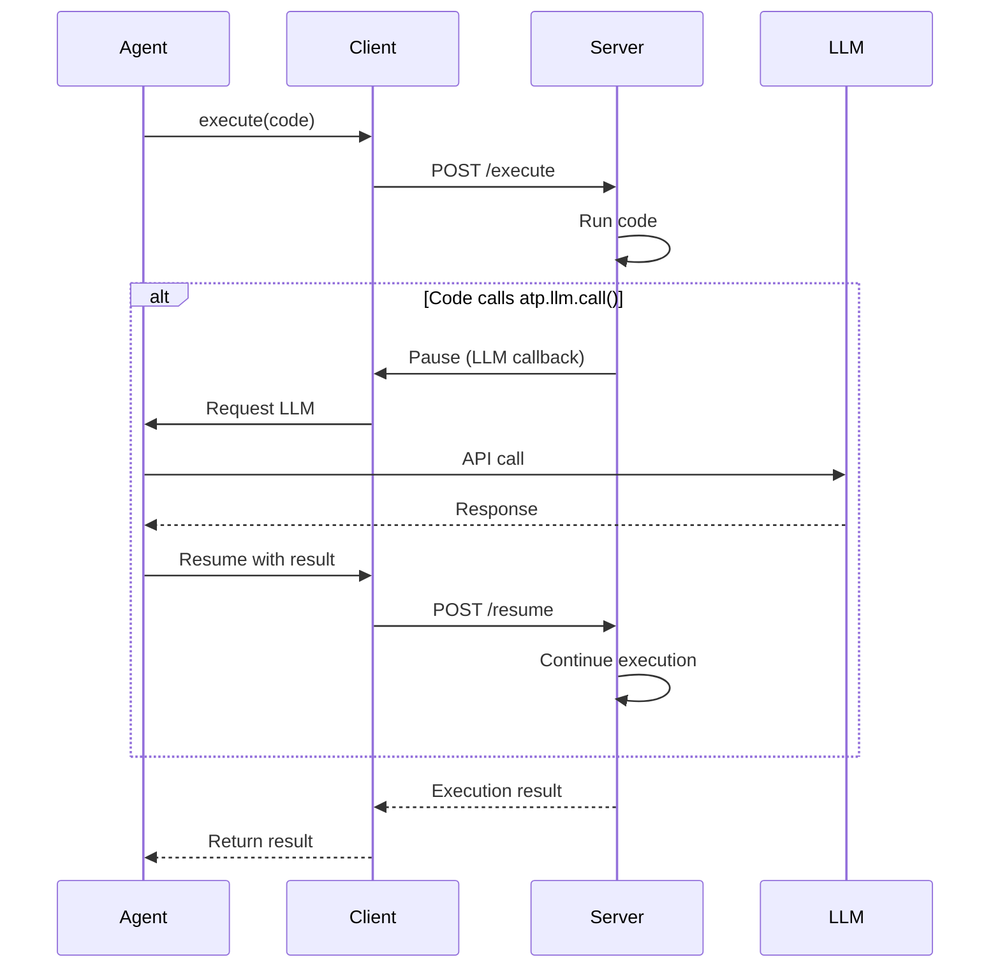

# @agent-tool-protocol/client

Client library for connecting to Agent Tool Protocol servers and executing code.

## Overview

The ATP client enables agents to connect to ATP servers, execute TypeScript code with runtime APIs, handle pauses for LLM/approval/embedding callbacks, and manage client-side tool execution.

## Installation

```bash
npm install @agent-tool-protocol/client
```

## Architecture



## Quick Start

### Basic Client

```typescript
import { AgentToolProtocolClient } from '@agent-tool-protocol/client';

const client = new AgentToolProtocolClient({
	baseUrl: 'http://localhost:3333',
	headers: {
		Authorization: 'Bearer your-api-key',
	},
});

await client.init();

// Execute code
const result = await client.execute({
	code: `
    const items = ['apple', 'banana', 'cherry'];
    return items.length;
  `,
});

console.log(result.result); // 3
```

### With LLM Support

```typescript
import { ChatOpenAI } from '@langchain/openai';

const llm = new ChatOpenAI({ modelName: 'gpt-4' });

const client = new AgentToolProtocolClient({
	baseUrl: 'http://localhost:3333',
	headers: { Authorization: 'Bearer key' },
});

// Provide LLM for atp.llm.* calls
client.provideLLM({
	call: async (prompt, options) => {
		const response = await llm.invoke(prompt);
		return response.content;
	},
});

await client.init();

// Now code can use atp.llm.call()
const result = await client.execute({
	code: `
    const joke = await atp.llm.call({
      prompt: 'Tell me a programming joke',
    });
    return joke;
  `,
});
```

### With Embeddings

```typescript
import { OpenAIEmbeddings } from '@langchain/openai';

const embeddings = new OpenAIEmbeddings();

client.provideEmbedding({
	embed: async (text) => {
		const vector = await embeddings.embedQuery(text);
		// Store and return ID
		return 'embedding-id-123';
	},
	search: async (query, options) => {
		const queryVector = await embeddings.embedQuery(query);
		// Perform similarity search
		return results;
	},
});

// Code can now use atp.embedding.*
const result = await client.execute({
	code: `
    const id = await atp.embedding.embed('Important document');
    const similar = await atp.embedding.search('document', { topK: 5 });
    return similar;
  `,
});
```

### With Approval Handler

```typescript
client.provideApproval({
	request: async (message, context) => {
		// Prompt user for approval
		const approved = await askUser(message);
		return {
			approved,
			response: { reason: 'User decision' },
			timestamp: Date.now(),
		};
	},
});

// Code can use atp.approval.request()
const result = await client.execute({
	code: `
    const approval = await atp.approval.request(
      'Delete all files?',
      { critical: true }
    );
    
    if (!approval.approved) {
      return { cancelled: true };
    }
    
    return { deleted: true };
  `,
});
```

### Client-Side Tools

Register custom tools that execute on the client:

```typescript
import { createClientTool } from '@agent-tool-protocol/client';

const fetchTool = createClientTool({
	name: 'fetch',
	description: 'Make HTTP requests from client',
	inputSchema: {
		type: 'object',
		properties: {
			url: { type: 'string' },
			method: { type: 'string', enum: ['GET', 'POST'] },
		},
		required: ['url'],
	},
	handler: async (input) => {
		const response = await fetch(input.url, {
			method: input.method || 'GET',
		});
		return await response.json();
	},
});

const client = new AgentToolProtocolClient({
	baseUrl: 'http://localhost:3333',
	headers: { Authorization: 'Bearer key' },
	serviceProviders: {
		tools: [fetchTool],
	},
});

await client.init(); // Registers tools with server

// Code can now use atp.tool.fetch()
const result = await client.execute({
	code: `
    const data = await atp.tool.fetch({
      url: 'https://api.example.com/data',
      method: 'GET',
    });
    return data;
  `,
});
```

### Pre-Request Hooks

Intercept and modify requests (e.g., token refresh):

```typescript
const client = new AgentToolProtocolClient({
	baseUrl: 'http://localhost:3333',
	hooks: {
		preRequest: async (context) => {
			// Refresh token if needed
			if (tokenExpired()) {
				const newToken = await refreshToken();
				return {
					headers: {
						...context.currentHeaders,
						Authorization: `Bearer ${newToken}`,
					},
				};
			}
			return {};
		},
	},
});
```

## Core Features

### Execute Code

```typescript
const result = await client.execute({
	code: 'return 1 + 1',
	timeout: 30000,
	pausable: true,
});

// Result structure
interface ExecutionResult {
	status: 'success' | 'error' | 'paused' | 'timeout';
	result?: unknown;
	error?: string;
	pauseReason?: string;
	executionId?: string;
}
```

### Search APIs

```typescript
const results = await client.search({
	query: 'user authentication',
	limit: 10,
});

// Search by natural language query
const searchResults = await client.searchQuery('how to create a user');
```

### Explore APIs

```typescript
const schema = await client.explore();

// Returns API structure
interface ExploreResult {
	apis: Array<{
		name: string;
		description: string;
		functions: Array<{
			name: string;
			description: string;
			parameters: unknown;
		}>;
	}>;
}
```

### Type Definitions

```typescript
const types = await client.getTypeDefinitions();
// Returns TypeScript definitions for atp.* APIs
```

## API Reference

### AgentToolProtocolClient

```typescript
class AgentToolProtocolClient {
	constructor(options: AgentToolProtocolClientOptions);

	// Initialize session
	init(clientInfo?: Record<string, unknown>): Promise<{
		clientId: string;
		token: string;
		expiresAt: number;
		tokenRotateAt: number;
	}>;

	// Execute code
	execute(config: ExecutionConfig): Promise<ExecutionResult>;

	// Resume paused execution
	resume(executionId: string, resumeData: ResumeData): Promise<ExecutionResult>;

	// Provide services
	provideLLM(handler: ClientLLMHandler): void;
	provideApproval(handler: ClientApprovalHandler): void;
	provideEmbedding(handler: ClientEmbeddingHandler): void;

	// API discovery
	search(options: SearchOptions): Promise<SearchResult[]>;
	searchQuery(query: string, options?: SearchOptions): Promise<SearchResult[]>;
	explore(): Promise<ExploreResult>;
	getTypeDefinitions(): Promise<string>;

	// Session info
	getClientId(): string;
}
```

### Options

```typescript
interface AgentToolProtocolClientOptions {
	baseUrl: string;
	headers?: Record<string, string>;
	serviceProviders?: {
		llm?: ClientLLMHandler;
		approval?: ClientApprovalHandler;
		embedding?: ClientEmbeddingHandler;
		tools?: ClientTool[];
	};
	hooks?: {
		preRequest?: (context: HookContext) => Promise<HookResult>;
	};
}
```

## Flow Diagram



## Error Handling

```typescript
import { ExecutionStatus } from '@agent-tool-protocol/client';

try {
	const result = await client.execute({ code: '...' });

	if (result.status === ExecutionStatus.ERROR) {
		console.error('Execution failed:', result.error);
	} else if (result.status === ExecutionStatus.TIMEOUT) {
		console.error('Execution timed out');
	} else if (result.status === ExecutionStatus.PAUSED) {
		console.log('Execution paused:', result.pauseReason);
		// Handle pause (resume later)
	}
} catch (error) {
	console.error('Client error:', error);
}
```

## TypeScript Support

Full TypeScript definitions with strict typing for all APIs.

## License

MIT
