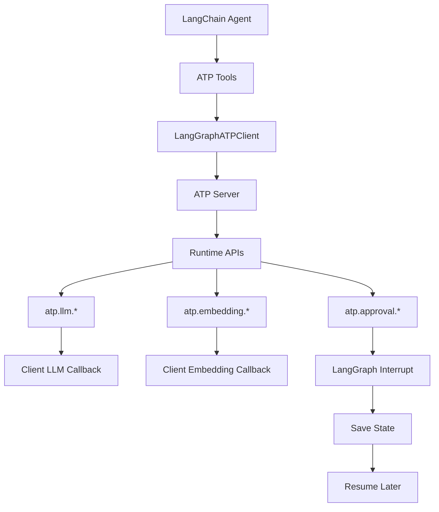
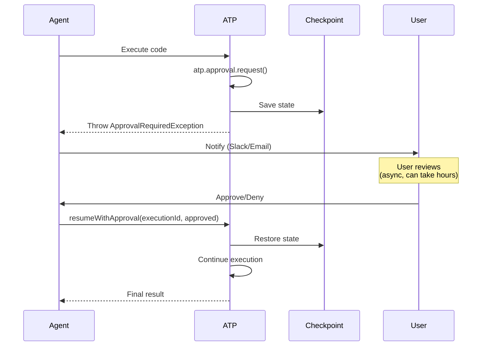

# @mondaydotcomorg/atp-langchain

LangChain and LangGraph integration for Agent Tool Protocol with production-ready human-in-the-loop support.

## Overview

This package integrates ATP with LangChain and LangGraph, enabling agents to generate and execute ATP code as tools. Includes production-ready async approval workflows using LangGraph interrupts and checkpoints.

## Installation

```bash
npm install @mondaydotcomorg/atp-langchain @langchain/core @langchain/langgraph
```

## Architecture



## Features

- 🤖 **LangChain Tools** - Use ATP as tools in any LangChain agent
- 🔄 **LangGraph Interrupts** - Production-ready async approvals
- 🧠 **LLM Sampling** - `atp.llm.call()` routes to your LangChain LLM
- 🔍 **Embedding Support** - `atp.embedding.*` routes to your embeddings model
- ✅ **Approval Workflows** - Human-in-the-loop via LangGraph checkpoints
- 💾 **State Persistence** - PostgreSQL/Redis checkpointing
- 📝 **TypeScript** - Full type safety

## Quick Start

### Simple Agent

```typescript
import { ChatOpenAI } from '@langchain/openai';
import { createReactAgent } from '@langchain/langgraph/prebuilt';
import { createATPTools } from '@mondaydotcomorg/atp-langchain';

const llm = new ChatOpenAI({ modelName: 'gpt-4' });

// Create ATP tools
const { tools } = await createATPTools('http://localhost:3333', 'your-api-key', { llm });

// Create agent
const agent = createReactAgent({ llm, tools });

// Run agent
const result = await agent.invoke({
	messages: [{ role: 'user', content: 'Execute ATP code to get a joke from the LLM' }],
});
```

### Production Agent with Approvals

```typescript
import { MemorySaver } from '@langchain/langgraph';
import { createATPTools, ApprovalRequiredException } from '@mondaydotcomorg/atp-langchain';

const llm = new ChatOpenAI({ modelName: 'gpt-4' });

// Create tools with interrupt-based approvals
const { client, tools, isApprovalRequired, resumeWithApproval } =
  await createATPTools('http://localhost:3333', 'api-key', { llm });

// Create agent with checkpointer
const checkpointer = new MemorySaver();
const agent = createReactAgent({ llm, tools, checkpointSaver: checkpointer });

try {
  await agent.invoke({ messages: [...] }, { configurable: { thread_id: 'thread-1' } });
} catch (error) {
  if (isApprovalRequired(error)) {
    const { executionId, message, context } = error.approvalRequest;

    // Save to DB, notify user via Slack/email
    console.log(`Approval needed: ${message}`);
    await notifyUser(message);

    // Wait for approval (async - can take hours/days)
    const approved = await waitForUserApproval(executionId);

    // Resume execution
    const result = await resumeWithApproval(executionId, approved);
  }
}
```

### With Embeddings

```typescript
import { ChatOpenAI, OpenAIEmbeddings } from '@langchain/openai';
import { createATPTools } from '@mondaydotcomorg/atp-langchain';

const llm = new ChatOpenAI({ modelName: 'gpt-4' });
const embeddings = new OpenAIEmbeddings({ model: 'text-embedding-3-small' });

// Create tools with LLM and embedding support
const { tools } = await createATPTools('http://localhost:3333', 'api-key', {
	llm,
	embeddings, // Enable atp.embedding.*
});

const agent = createReactAgent({ llm, tools });

// Agent can now generate code that uses embeddings:
// const id = await atp.embedding.embed("Store this text");
// const results = await atp.embedding.search("Find similar", { topK: 5 });
```

## How It Works

### ATP Runtime in LangChain

When agents use ATP tools, they can generate TypeScript code using ATP's runtime APIs:

```typescript
// Agent generates this code:
const idea = await atp.llm.call({
	prompt: 'Generate a product idea',
});

// Store embedding for semantic search
const embeddingId = await atp.embedding.embed(idea);

// Request approval
const approval = await atp.approval.request(`Launch product: ${idea}?`, { idea });

if (approval.approved) {
	return await atp.llm.call({
		prompt: `Create marketing copy for: ${idea}`,
	});
}
```

### LLM Sampling

`atp.llm.call()` routes to your LangChain LLM:

- Uses the same LLM as your agent
- Fresh context for sub-reasoning
- Supports `call()`, `extract()`, `classify()`

```typescript
// In ATP code:
const analysis = await atp.llm.call({
	prompt: 'Analyze this data: ' + JSON.stringify(data),
	temperature: 0.7,
	model: 'gpt-4',
});
```

### Approval Interrupts

When ATP code calls `atp.approval.request()`, LangGraph interrupts:

1. **Pause** - Execution pauses, state saved to checkpoint
2. **Notify** - Your code sends approval request (Slack, email, UI)
3. **Wait** - User reviews asynchronously (hours/days OK)
4. **Resume** - Call `resumeWithApproval()` with decision
5. **Continue** - Execution resumes from checkpoint



## API Reference

### createATPTools()

```typescript
async function createATPTools(
	serverUrl: string,
	apiKey: string,
	options: CreateATPToolsOptions
): Promise<ATPToolsResult>;
```

**Options:**

```typescript
interface CreateATPToolsOptions {
	llm: BaseChatModel; // Required: LangChain LLM
	embeddings?: Embeddings; // Optional: Embeddings model
	useLangGraphInterrupts?: boolean; // Default: true
	approvalHandler?: ApprovalHandler; // If interrupts disabled
	defaultExecutionConfig?: ExecutionConfig;
}
```

**Returns:**

```typescript
interface ATPToolsResult {
	client: LangGraphATPClient;
	tools: Tool[]; // LangChain tools
	isApprovalRequired: (error: any) => boolean;
	resumeWithApproval: (executionId: string, approved: boolean, reason?: string) => Promise<any>;
}
```

### LangGraphATPClient

```typescript
class LangGraphATPClient extends AgentToolProtocolClient {
	execute(code: string, config?: ExecutionConfig): Promise<ExecutionResult>;
	resumeWithApproval(executionId: string, approved: boolean, reason?: string): Promise<any>;
	getPendingApproval(executionId: string): Promise<ApprovalRequest | null>;
}
```

### ApprovalRequiredException

```typescript
class ApprovalRequiredException extends Error {
	approvalRequest: {
		executionId: string;
		message: string;
		context?: any;
		timestamp: number;
	};
}
```

## Production Patterns

### PostgreSQL Checkpointing

```typescript
import { PostgresSaver } from '@langchain/langgraph-checkpoint-postgres';

const checkpointer = new PostgresSaver({
	connectionString: process.env.DATABASE_URL,
});

const agent = createReactAgent({
	llm,
	tools,
	checkpointSaver: checkpointer,
});

// State persists across restarts
```

### Async Approval via Slack

```typescript
if (isApprovalRequired(error)) {
	const { executionId, message, context } = error.approvalRequest;

	// Save to database
	await db.approvals.create({
		id: executionId,
		message,
		context,
		status: 'pending',
	});

	// Send Slack notification
	await slack.chat.postMessage({
		channel: '#approvals',
		text: message,
		blocks: [
			{
				type: 'actions',
				elements: [
					{ type: 'button', text: 'Approve', action_id: 'approve' },
					{ type: 'button', text: 'Deny', action_id: 'deny' },
				],
			},
		],
	});
}

// In Slack webhook handler:
app.post('/slack/actions', async (req, res) => {
	const { action_id } = req.body;
	const executionId = req.body.state.executionId;

	const approved = action_id === 'approve';
	const result = await resumeWithApproval(executionId, approved);

	await db.approvals.update(executionId, { status: approved ? 'approved' : 'denied' });
	res.json({ ok: true });
});
```

### Multiple Sequential Approvals

```typescript
// Agent generates ATP code with multiple approvals:
const step1 = await atp.approval.request('Approve step 1?');
if (!step1.approved) return { cancelled: true };

const step2 = await atp.approval.request('Approve step 2?');
if (!step2.approved) return { cancelled: true };

return { success: true };
```

Each `atp.approval.request()` triggers a new interrupt → checkpoint → resume cycle.

## Comparison: Direct vs Interrupt Mode

### Direct Mode

```typescript
const { tools } = await createATPTools(url, key, {
	llm,
	useLangGraphInterrupts: false,
	approvalHandler: async (message) => {
		return await promptUser(message); // Blocks
	},
});
```

**Pros:** Simpler setup, good for CLI tools  
**Cons:** Blocks execution, no persistence, not production-ready

### Interrupt Mode ⭐ Recommended

```typescript
const { tools, isApprovalRequired, resumeWithApproval } = await createATPTools(url, key, { llm });

try {
	await agent.invoke({ messages });
} catch (error) {
	if (isApprovalRequired(error)) {
		await handleApprovalAsync(error.approvalRequest);
	}
}
```

**Pros:** Non-blocking, state persists, production-ready, multi-user support  
**Cons:** Slightly more complex setup

## Examples

See [`examples/langchain-react-agent/`](../../examples/langchain-react-agent/):

- **`simple-test.ts`** - Integration test with all 3 ATP tools
- **`simple-agent.ts`** - Basic React agent without approvals
- **`agent.ts`** - Production agent with interrupts and checkpoints

### RAG with Embeddings

```typescript
import { ChatOpenAI, OpenAIEmbeddings } from '@langchain/openai';
import { createATPTools } from '@mondaydotcomorg/atp-langchain';

const llm = new ChatOpenAI({ modelName: 'gpt-4' });
const embeddings = new OpenAIEmbeddings();

const { tools } = await createATPTools(url, key, { llm, embeddings });
const agent = createReactAgent({ llm, tools });

// Agent can do RAG:
const result = await agent.invoke({
	messages: [
		{
			role: 'user',
			content: `Use ATP to:
      1. Embed these documents: ["AI is...", "ML is...", "DL is..."]
      2. Search for content similar to "neural networks"
      3. Use atp.llm.call() to answer based on results`,
		},
	],
});
```

## TypeScript Support

```typescript
import type {
	LangGraphATPClient,
	LangGraphATPClientOptions,
	ApprovalRequest,
	ApprovalResponse,
	CreateATPToolsOptions,
	ATPToolsResult,
} from '@mondaydotcomorg/atp-langchain';
```

## Requirements

- Node.js 18+
- TypeScript 5.0+
- `@langchain/core` ^0.3.0
- `@langchain/langgraph` ^0.2.0

## License

MIT

## Learn More

- [ATP Documentation](../../README.md)
- [LangGraph Human-in-the-Loop](https://langchain-ai.github.io/langgraphjs/how-tos/human-in-the-loop/)
- [LangChain Tools](https://js.langchain.com/docs/modules/agents/tools/)
- [Examples](../../examples/langchain-react-agent/)
