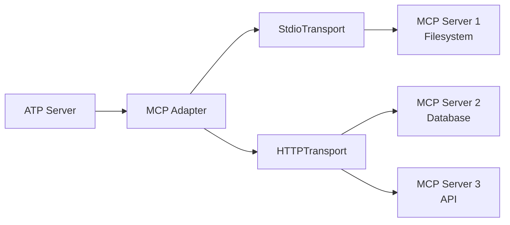
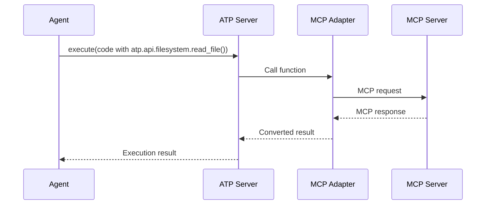

# @mondaydotcomorg/atp-mcp-adapter

Model Context Protocol (MCP) adapter for Agent Tool Protocol - connect MCP servers and use their tools in ATP.

## Overview

This package enables seamless integration between MCP (Model Context Protocol) servers and ATP servers. Connect to any MCP server (stdio or HTTP) and expose their tools as ATP APIs.

## Installation

```bash
npm install @mondaydotcomorg/atp-mcp-adapter
```

## Architecture



## Quick Start

### Connect to MCP Server (stdio)

```typescript
import { createServer } from '@agent-tool-protocol/server';
import { MCPConnector } from '@mondaydotcomorg/atp-mcp-adapter';

const server = createServer();
const mcpConnector = new MCPConnector();

// Connect to filesystem MCP server
const filesystemAPI = await mcpConnector.connectToMCPServer({
	name: 'filesystem',
	command: 'npx',
	args: ['-y', '@modelcontextprotocol/server-filesystem', '/path/to/files'],
	env: {
		LOG_LEVEL: 'info',
	},
});

server.addAPIGroup(filesystemAPI);

await server.start(3333);

// Agents can now use MCP tools:
// await atp.api.filesystem.read_file({ path: 'README.md' })
// await atp.api.filesystem.write_file({ path: 'file.txt', content: 'Hello' })
```

### Connect to HTTP MCP Server

```typescript
import { MCPHttpConnector } from '@mondaydotcomorg/atp-mcp-adapter';

const httpConnector = new MCPHttpConnector();

const databaseAPI = await httpConnector.connectToHttpServer({
	name: 'database',
	baseUrl: 'http://localhost:8080/mcp',
	headers: {
		Authorization: 'Bearer token',
	},
});

server.addAPIGroup(databaseAPI);

// Agents can use:
// await atp.api.database.query({ sql: 'SELECT * FROM users' })
```

### Multiple MCP Servers

```typescript
const mcpConnector = new MCPConnector();

const apis = await mcpConnector.connectToMultipleServers([
	{
		name: 'filesystem',
		command: 'npx',
		args: ['-y', '@modelcontextprotocol/server-filesystem', '/data'],
	},
	{
		name: 'git',
		command: 'npx',
		args: ['-y', '@modelcontextprotocol/server-git', '/repo'],
	},
	{
		name: 'database',
		command: 'npx',
		args: ['-y', '@modelcontextprotocol/server-postgres'],
		env: {
			DATABASE_URL: process.env.DATABASE_URL,
		},
	},
]);

apis.forEach((api) => server.addAPIGroup(api));

// Agents can now use:
// - atp.api.filesystem.*
// - atp.api.git.*
// - atp.api.database.*
```

## MCP Connectors

### MCPConnector (stdio)

Connect to MCP servers running as child processes via stdio.

```typescript
import { MCPConnector } from '@mondaydotcomorg/atp-mcp-adapter';

const connector = new MCPConnector();

const apiGroup = await connector.connectToMCPServer({
  name: string;         // API group name
  command: string;      // Command to execute
  args: string[];       // Command arguments
  env?: Record<string, string>;  // Environment variables
});
```

**Examples:**

```typescript
// Filesystem MCP server
const filesystem = await connector.connectToMCPServer({
	name: 'files',
	command: 'npx',
	args: ['-y', '@modelcontextprotocol/server-filesystem', '/data'],
});

// Custom Python MCP server
const custom = await connector.connectToMCPServer({
	name: 'custom',
	command: 'python',
	args: ['mcp_server.py'],
	env: {
		API_KEY: process.env.API_KEY,
	},
});
```

### MCPHttpConnector

Connect to MCP servers over HTTP.

```typescript
import { MCPHttpConnector } from '@mondaydotcomorg/atp-mcp-adapter';

const connector = new MCPHttpConnector();

const apiGroup = await connector.connectToHttpServer({
  name: string;         // API group name
  baseUrl: string;      // MCP server URL
  headers?: Record<string, string>;  // HTTP headers
});
```

**Example:**

```typescript
const api = await connector.connectToHttpServer({
	name: 'remote-api',
	baseUrl: 'https://mcp.example.com',
	headers: {
		Authorization: 'Bearer token',
		'X-API-Key': process.env.API_KEY,
	},
});
```

## Tool Conversion

MCP tools are automatically converted to ATP format:

```typescript
// MCP tool definition
{
  name: 'read_file',
  description: 'Read file contents',
  inputSchema: {
    type: 'object',
    properties: {
      path: { type: 'string' }
    },
    required: ['path']
  }
}

// Converted to ATP function
{
  name: 'read_file',
  description: 'Read file contents',
  inputSchema: { /* same schema */ },
  handler: async (input) => {
    // Calls MCP server
    const result = await mcpClient.callTool({
      name: 'read_file',
      arguments: input
    });
    return result.content;
  }
}
```

## Agent Usage

Once MCP servers are connected, agents can use their tools naturally:

```typescript
// Agent-generated code
const files = await atp.api.filesystem.list_directory({
	path: '/data',
});

atp.log.info('Found files', { count: files.length });

for (const file of files) {
	const content = await atp.api.filesystem.read_file({
		path: file.path,
	});

	// Process with LLM
	const summary = await atp.llm.call({
		prompt: `Summarize this file: ${content}`,
	});

	// Write summary
	await atp.api.filesystem.write_file({
		path: `${file.path}.summary`,
		content: summary,
	});
}
```

## MCP Server Examples

### Official MCP Servers

```typescript
// Filesystem
await connector.connectToMCPServer({
	name: 'filesystem',
	command: 'npx',
	args: ['-y', '@modelcontextprotocol/server-filesystem', '/path'],
});

// Git
await connector.connectToMCPServer({
	name: 'git',
	command: 'npx',
	args: ['-y', '@modelcontextprotocol/server-git', '/repo'],
});

// PostgreSQL
await connector.connectToMCPServer({
	name: 'postgres',
	command: 'npx',
	args: ['-y', '@modelcontextprotocol/server-postgres'],
	env: {
		DATABASE_URL: process.env.DATABASE_URL,
	},
});

// Puppeteer (browser automation)
await connector.connectToMCPServer({
	name: 'browser',
	command: 'npx',
	args: ['-y', '@modelcontextprotocol/server-puppeteer'],
});
```

### Custom MCP Server

Create your own MCP server:

```python
# mcp_server.py
from mcp.server import Server, Tool

server = Server("custom-mcp-server")

@server.tool()
async def process_data(data: str) -> dict:
    """Process data and return result"""
    result = perform_processing(data)
    return {"result": result}

if __name__ == "__main__":
    server.run()
```

Connect in ATP:

```typescript
await connector.connectToMCPServer({
	name: 'custom',
	command: 'python',
	args: ['mcp_server.py'],
});
```

## Error Handling

```typescript
try {
	const api = await connector.connectToMCPServer({
		name: 'filesystem',
		command: 'npx',
		args: ['-y', '@modelcontextprotocol/server-filesystem', '/path'],
	});
	server.addAPIGroup(api);
} catch (error) {
	console.error('Failed to connect to MCP server:', error);
	// Handle connection error
}
```

## Lifecycle Management

```typescript
const connector = new MCPConnector();

// Connect
const api = await connector.connectToMCPServer(config);

// List connected servers
const servers = connector.listServers();
// Returns: ['filesystem', 'git', 'database']

// Close specific server
await connector.closeServer('filesystem');

// Close all servers
await connector.closeAll();
```

## Types

```typescript
interface MCPServerConfig {
	name: string;
	command: string;
	args: string[];
	env?: Record<string, string>;
}

interface MCPHttpConfig {
	name: string;
	baseUrl: string;
	headers?: Record<string, string>;
}

interface MCPTool {
	name: string;
	description?: string;
	inputSchema: {
		type: string;
		properties?: Record<string, unknown>;
		required?: string[];
	};
}
```

## Integration Flow



## Benefits

- ✅ **Zero modifications** to existing MCP servers
- ✅ **Automatic tool discovery** and conversion
- ✅ **Type-safe** integration with ATP
- ✅ **Support for stdio and HTTP** transports
- ✅ **Multiple server connections** in single ATP server
- ✅ **Error handling** and lifecycle management

## TypeScript Support

Full TypeScript definitions included.

## License

MIT
