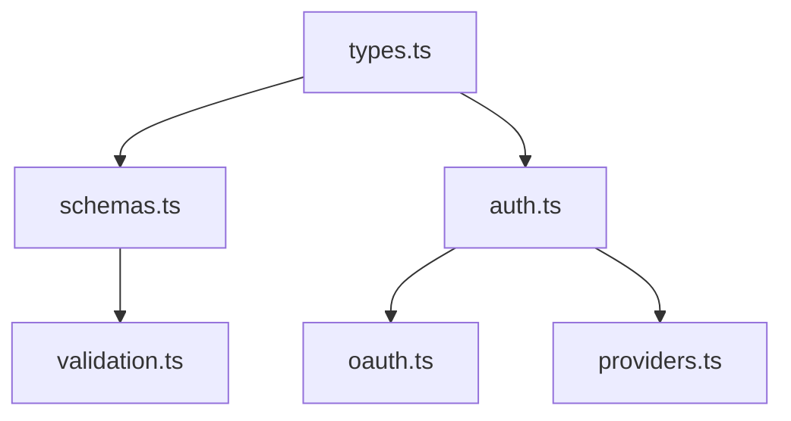

# @mondaydotcomorg/atp-protocol

Core protocol types, schemas, validation, and authentication for Agent Tool Protocol.

## Overview

This package provides the foundational types and interfaces used across ATP, including JSON-RPC schemas, OAuth providers, authentication, and validation utilities.

## Installation

```bash
npm install @mondaydotcomorg/atp-protocol
```

## Architecture



## Core Components

### Types

Defines all core ATP types including:

- **Protocol**: `AgentToolProtocolRequest`, `AgentToolProtocolResponse`, JSON-RPC messages
- **Execution**: `ExecutionConfig`, `ExecutionResult`, `ExecutionStatus`
- **Callbacks**: `CallbackType`, `ClientLLMHandler`, `ClientApprovalHandler`, `ClientEmbeddingHandler`
- **Tools**: `ClientTool`, `ToolMetadata`, `CustomFunctionDef`
- **Providers**: `CacheProvider`, `AuthProvider`, `AuditSink`

```typescript
import type {
	AgentToolProtocolRequest,
	ExecutionResult,
	ExecutionConfig,
	CallbackType,
	ClientLLMHandler,
} from '@mondaydotcomorg/atp-protocol';
```

### Schemas

Zod schemas for runtime validation:

```typescript
import {
	ExecutionConfigSchema,
	ExecutionResultSchema,
	SearchOptionsSchema,
} from '@mondaydotcomorg/atp-protocol';

// Validate execution config
const config = ExecutionConfigSchema.parse(userInput);
```

### Validation

Validation utilities:

```typescript
import { validateExecutionConfig, validateToolDefinition } from '@mondaydotcomorg/atp-protocol';

const errors = validateExecutionConfig(config);
if (errors.length > 0) {
	console.error('Validation failed:', errors);
}
```

### Authentication

Base interfaces for authentication:

```typescript
import type { AuthProvider } from '@mondaydotcomorg/atp-protocol';

class CustomAuthProvider implements AuthProvider {
	name = 'custom';

	async getCredentials(key: string) {
		// Return credentials for the given key
	}
}
```

### OAuth

OAuth provider interfaces and utilities:

```typescript
import type { OAuthProvider, OAuthScopeChecker } from '@mondaydotcomorg/atp-protocol';

// Implement OAuth provider
class GoogleOAuthProvider implements OAuthProvider {
	name = 'google';

	async generateAuthUrl(config) {
		// Generate OAuth URL
	}

	async handleCallback(code, config) {
		// Exchange code for tokens
	}
}
```

## Key Types

### Execution

```typescript
interface ExecutionConfig {
	code: string;
	apiKey?: string;
	timeout?: number;
	pausable?: boolean;
	resumeFromState?: ResumeState;
	context?: Record<string, unknown>;
}

interface ExecutionResult {
	status: ExecutionStatus;
	result?: unknown;
	error?: string;
	pauseReason?: string;
	executionId?: string;
}

enum ExecutionStatus {
	SUCCESS = 'success',
	ERROR = 'error',
	PAUSED = 'paused',
	TIMEOUT = 'timeout',
}
```

### Callbacks

```typescript
enum CallbackType {
	LLM = 'llm',
	APPROVAL = 'approval',
	EMBEDDING = 'embedding',
	TOOL = 'tool',
}

interface ClientServices {
	hasLLM: boolean;
	hasApproval: boolean;
	hasEmbedding: boolean;
	hasTools: boolean;
	toolNames?: string[];
}
```

### Providers

```typescript
interface CacheProvider {
	name: string;
	get<T>(key: string): Promise<T | null>;
	set(key: string, value: unknown, ttl?: number): Promise<void>;
	delete(key: string): Promise<void>;
	has(key: string): Promise<boolean>;
}

interface AuthProvider {
	name: string;
	getCredentials(key: string): Promise<UserCredentialData | null>;
	setCredentials(key: string, credentials: UserCredentialData): Promise<void>;
	deleteCredentials(key: string): Promise<void>;
}

interface AuditSink {
	write(event: AuditEvent): Promise<void>;
	flush?(): Promise<void>;
}
```

## Exports

```typescript
// Types
export * from './types';

// Schemas (Zod)
export * from './schemas';

// Validation utilities
export * from './validation';

// Auth interfaces
export * from './auth';

// OAuth interfaces
export * from './oauth';

// Provider interfaces
export * from './providers';
```

## Usage Example

```typescript
import {
	type AgentToolProtocolRequest,
	type ExecutionConfig,
	ExecutionConfigSchema,
	ExecutionStatus,
	CallbackType,
} from '@mondaydotcomorg/atp-protocol';

// Create execution config with validation
const config: ExecutionConfig = {
	code: 'const result = await atp.llm.call({ prompt: "Hello" });',
	timeout: 30000,
	pausable: true,
};

// Validate
const validated = ExecutionConfigSchema.parse(config);

// Check status
if (result.status === ExecutionStatus.PAUSED) {
	console.log('Execution paused for callback');
}
```

## TypeScript Support

Full TypeScript definitions included with strict type checking.

## License

MIT
