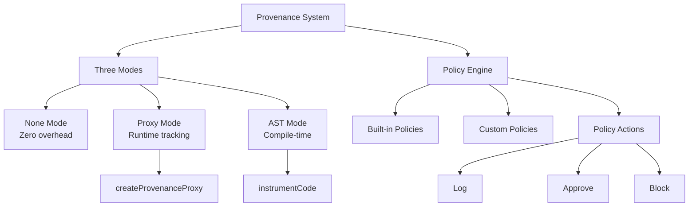

# @agent-tool-protocol/provenance

CAMEL-inspired provenance security for LLM applications - track data origin and enforce security policies to defend against prompt injection attacks.

## Overview

This package implements provenance tracking and security policy enforcement inspired by Google Research's CAMEL paper. It provides three modes with different security/performance trade-offs to protect against prompt injection, data exfiltration, and other LLM security threats.

## Installation

```bash
npm install @agent-tool-protocol/provenance
```

## Architecture



## Three Modes

### None Mode (Default)

No provenance tracking, zero overhead.

```typescript
// Default mode - no tracking
const user = { name: 'Alice', ssn: '123-45-6789' };
// Works normally with no overhead
```

### Proxy Mode

Runtime tracking with 5-10% overhead using JavaScript Proxies.

```typescript
import { createProvenanceProxy, ProvenanceSource } from '@agent-tool-protocol/provenance';

const user = createProvenanceProxy(
	{ name: 'Alice', ssn: '123-45-6789' },
	{
		type: ProvenanceSource.TOOL,
		toolName: 'getUser',
		apiGroup: 'users',
		timestamp: Date.now(),
	},
	{
		type: 'restricted',
		readers: ['alice@company.com'],
	}
);

// Provenance tracked automatically
console.log(user.name); // Proxy tracks access
```

### AST Mode

Compile-time instrumentation with 20-30% overhead, tracks primitive tainting.

```typescript
import { instrumentCode, createTrackingRuntime } from '@agent-tool-protocol/provenance';

const { code } = instrumentCode(`
  const user = await api.users.getUser({ id: '123' });
  const email = user.email; // Taint propagates to email
  await api.email.send({ to: 'external@company.com', body: email });
`);

const runtime = createTrackingRuntime();
// Execute instrumented code with runtime
```

## Security Policy Engine

### Quick Start

```typescript
import {
	SecurityPolicyEngine,
	preventDataExfiltration,
	requireUserOrigin,
} from '@agent-tool-protocol/provenance';

const policyEngine = new SecurityPolicyEngine(
	[preventDataExfiltration, requireUserOrigin],
	console // Logger (pino, winston, or console)
);

// Check before sensitive operations
try {
	await policyEngine.checkTool('send', 'email', {
		to: 'attacker@evil.com',
		body: user, // Contains provenance metadata
	});
} catch (error) {
	console.error('Security policy blocked:', error.message);
}
```

### Built-in Policies

```typescript
import {
	preventDataExfiltration, // Block data exfiltration
	preventDataExfiltrationWithApproval, // Require approval for exfiltration
	requireUserOrigin, // Require user-originated data
	requireUserOriginWithApproval, // Require approval for non-user data
	blockLLMRecipients, // Block LLM-extracted recipients
	blockLLMRecipientsWithApproval, // Require approval for LLM recipients
	auditSensitiveAccess, // Log all sensitive access
	getBuiltInPolicies, // All block policies
	getBuiltInPoliciesWithApproval, // All approval policies
} from '@agent-tool-protocol/provenance';
```

### Custom Policies

```typescript
import { createCustomPolicy, type SecurityPolicy } from '@agent-tool-protocol/provenance';

const blockExternalAPIs: SecurityPolicy = createCustomPolicy({
	name: 'blockExternalAPIs',
	description: 'Block calls to external APIs',
	check: async (toolName, apiGroup, args, metadata) => {
		const externalAPIs = ['external-api', 'third-party'];

		if (externalAPIs.includes(apiGroup)) {
			return {
				action: 'block',
				reason: 'External API calls are not allowed',
			};
		}

		return { action: 'approve' };
	},
});

const engine = new SecurityPolicyEngine([blockExternalAPIs], console);
```

## Policy Actions

Policies can return three actions:

```typescript
type PolicyAction = 'log' | 'approve' | 'block';

interface PolicyResult {
	action: PolicyAction;
	reason?: string;
	metadata?: Record<string, unknown>;
}
```

- **log**: Log the operation but allow it
- **approve**: Explicitly approve the operation
- **block**: Block the operation and throw error

## Provenance Metadata

### Track Data Sources

```typescript
import { ProvenanceSource } from '@agent-tool-protocol/provenance';

enum ProvenanceSource {
	USER = 0, // User-provided data
	LLM = 1, // LLM-generated data
	TOOL = 2, // Tool/API response
	SYSTEM = 3, // System-generated data
}

interface ProvenanceMetadata {
	source: SourceMetadata;
	readers?: ReaderPermissions;
	timestamp: number;
}
```

### Get Provenance

```typescript
import { getProvenance, hasProvenance } from '@agent-tool-protocol/provenance';

const user = createProvenanceProxy(userData, source, readers);

// Check if object has provenance
if (hasProvenance(user)) {
	const metadata = getProvenance(user);
	console.log('Source:', metadata.source);
	console.log('Readers:', metadata.readers);
}
```

## Pause/Resume Support

Provenance integrates with ATP's pause/resume mechanism:

```typescript
import {
	captureProvenanceState,
	restoreProvenanceState,
	setProvenanceExecutionId,
	cleanupProvenanceForExecution,
} from '@agent-tool-protocol/provenance';

// Before execution
setProvenanceExecutionId('exec-123');

// Capture state before pause
const state = captureProvenanceState();

// Later, restore state on resume
restoreProvenanceState(state);

// Cleanup after execution
cleanupProvenanceForExecution('exec-123');
```

## Integration with ATP Server

```typescript
import { createServer, ProvenanceMode } from '@agent-tool-protocol/server';
import { preventDataExfiltration, requireUserOrigin } from '@agent-tool-protocol/server';

const server = createServer({
	execution: {
		provenanceMode: ProvenanceMode.PROXY, // or ProvenanceMode.AST
		securityPolicies: [preventDataExfiltration, requireUserOrigin],
	},
});

// All tool calls now enforce provenance policies
```

## Real-World Examples

### Prevent Data Exfiltration

```typescript
// User's sensitive data
const user = createProvenanceProxy(
	{ name: 'Alice', ssn: '123-45-6789' },
	{ type: ProvenanceSource.TOOL, toolName: 'getUser' },
	{ type: 'restricted', readers: ['alice@company.com'] }
);

const engine = new SecurityPolicyEngine([preventDataExfiltration], console);

// This will throw - external email with restricted data
await engine.checkTool('send', 'email', {
	to: 'attacker@evil.com',
	body: user,
});
// ❌ Throws: ProvenanceSecurityError

// This will succeed - internal email
await engine.checkTool('send', 'email', {
	to: 'alice@company.com',
	body: user,
});
// ✅ Allowed
```

### Require User Origin

```typescript
// LLM-generated email address (untrusted)
const recipient = createProvenanceProxy(
	'external@untrusted.com',
	{ type: ProvenanceSource.LLM },
	null
);

const engine = new SecurityPolicyEngine([requireUserOrigin], console);

// This will throw - LLM-generated recipient
await engine.checkTool('send', 'email', {
	to: recipient,
	subject: 'Hello',
});
// ❌ Throws: Non-user-originated data in sensitive field

// User-provided recipient (trusted)
const userRecipient = createProvenanceProxy(
	'verified@company.com',
	{ type: ProvenanceSource.USER },
	null
);

await engine.checkTool('send', 'email', {
	to: userRecipient,
	subject: 'Hello',
});
// ✅ Allowed
```

### Approval Workflows

```typescript
import { preventDataExfiltrationWithApproval } from '@agent-tool-protocol/provenance';

const engine = new SecurityPolicyEngine([preventDataExfiltrationWithApproval], console);

// Set approval callback
engine.setApprovalCallback(async (request) => {
	console.log(`Approval needed: ${request.reason}`);
	// In production: show UI, send to Slack, etc.
	const approved = await getUserApproval(request);
	return { approved };
});

// This will request approval instead of blocking
await engine.checkTool('send', 'email', {
	to: 'external@company.com',
	body: sensitiveData,
});
// → Calls approval callback
// → Proceeds if approved, blocks if denied
```

## Performance

| Mode  | Overhead | Use Case                            |
| ----- | -------- | ----------------------------------- |
| None  | 0%       | No security requirements            |
| Proxy | 5-10%    | Production with moderate security   |
| AST   | 20-30%   | Maximum security, tracks primitives |

## Primitive Taint Tracking (AST Mode)

```typescript
import {
	markPrimitiveTainted,
	isPrimitiveTainted,
	getProvenanceForPrimitive,
} from '@agent-tool-protocol/provenance';

// Mark primitive as tainted
markPrimitiveTainted('sensitive-string', metadata);

// Check if primitive is tainted
if (isPrimitiveTainted('sensitive-string')) {
	const provenance = getProvenanceForPrimitive('sensitive-string');
	console.log('String is tainted:', provenance);
}
```

## API Reference

### Core Functions

```typescript
createProvenanceProxy<T>(value: T, source: SourceMetadata, readers: ReaderPermissions): Proxied<T>
getProvenance(value: unknown): ProvenanceMetadata | null
hasProvenance(value: unknown): boolean
getAllProvenance(value: unknown): ProvenanceMetadata[]
canRead(metadata: ProvenanceMetadata, reader: string): boolean
```

### AST Mode

```typescript
instrumentCode(code: string): { code: string; metadata: unknown }
createTrackingRuntime(): Runtime
```

### Policy Engine

```typescript
new SecurityPolicyEngine(policies: SecurityPolicy[], logger: Logger)
engine.checkTool(toolName: string, apiGroup: string, args: unknown): Promise<void>
engine.setApprovalCallback(callback: ApprovalCallback): void
```

### State Management

```typescript
setProvenanceExecutionId(executionId: string): void
clearProvenanceExecutionId(): void
captureProvenanceState(): ProvenanceState
restoreProvenanceState(state: ProvenanceState): void
cleanupProvenanceForExecution(executionId: string): void
```

## TypeScript Support

Full TypeScript definitions with strict typing.

## Credits

Inspired by Google Research's CAMEL paper:

- Paper: [CAMEL: Capability-Aware Machine Execution Language](https://arxiv.org/abs/2410.02904)
- GitHub: https://github.com/google-research/camel-prompt-injection

## License

MIT
