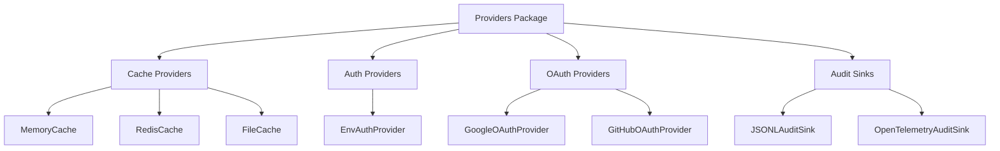

# @mondaydotcomorg/atp-providers

Production-ready provider implementations for ATP (cache, auth, OAuth, audit).

## Overview

This package provides concrete implementations of ATP provider interfaces including cache backends, authentication providers, OAuth integrations, and audit sinks.

## Installation

```bash
npm install @mondaydotcomorg/atp-providers
```

## Architecture



## Cache Providers

### MemoryCache

In-memory cache for development and testing.

```typescript
import { MemoryCache } from '@mondaydotcomorg/atp-providers';

const cache = new MemoryCache({
	defaultTTL: 3600, // 1 hour
	maxSize: 1000, // Max entries
});

await cache.set('key', value, 3600);
const cached = await cache.get('key');
await cache.delete('key');
```

### RedisCache

Redis-backed cache for production and distributed systems.

```typescript
import { RedisCache } from '@mondaydotcomorg/atp-providers';
import Redis from 'ioredis';

const redis = new Redis({
	host: 'localhost',
	port: 6379,
	password: process.env.REDIS_PASSWORD,
});

const cache = new RedisCache({
	redis,
	keyPrefix: 'atp:',
	defaultTTL: 3600,
});

await cache.set('key', value, 3600);
const cached = await cache.get('key');
```

**Benefits:**

- Cross-pod state sharing
- Persistent storage
- High performance
- Production-ready

### FileCache

File-based cache for simple persistence.

```typescript
import { FileCache } from '@mondaydotcomorg/atp-providers';

const cache = new FileCache({
	directory: './cache',
	defaultTTL: 3600,
});

await cache.set('key', value);
const cached = await cache.get('key');
```

## Auth Providers

### EnvAuthProvider

Environment-based authentication for simple use cases.

```typescript
import { EnvAuthProvider } from '@mondaydotcomorg/atp-providers';

const authProvider = new EnvAuthProvider({
	envPrefix: 'AUTH_', // Reads AUTH_* env vars
});

// Set credentials
await authProvider.setCredentials('github', {
	accessToken: 'ghp_...',
	refreshToken: null,
	expiresAt: null,
});

// Get credentials
const credentials = await authProvider.getCredentials('github');
console.log(credentials.accessToken);
```

## OAuth Providers

### GoogleOAuthProvider

Google OAuth 2.0 integration.

```typescript
import { GoogleOAuthProvider } from '@mondaydotcomorg/atp-providers';

const oauth = new GoogleOAuthProvider({
	clientId: process.env.GOOGLE_CLIENT_ID,
	clientSecret: process.env.GOOGLE_CLIENT_SECRET,
	redirectUri: 'http://localhost:3333/oauth/callback',
	scopes: [
		'https://www.googleapis.com/auth/userinfo.email',
		'https://www.googleapis.com/auth/calendar',
	],
});

// Generate auth URL
const authUrl = await oauth.generateAuthUrl({
	state: 'random-state',
});

// Handle callback
const tokens = await oauth.handleCallback('authorization-code', {
	state: 'random-state',
});

// Refresh token
const newTokens = await oauth.refreshToken('refresh-token');

// Check scopes
const hasScope = await oauth.checkScopes(tokens.accessToken, [
	'https://www.googleapis.com/auth/calendar',
]);
```

### GitHubOAuthProvider

GitHub OAuth integration.

```typescript
import { GitHubOAuthProvider } from '@mondaydotcomorg/atp-providers';

const oauth = new GitHubOAuthProvider({
	clientId: process.env.GITHUB_CLIENT_ID,
	clientSecret: process.env.GITHUB_CLIENT_SECRET,
	redirectUri: 'http://localhost:3333/oauth/callback',
	scopes: ['repo', 'user'],
});

const authUrl = await oauth.generateAuthUrl({ state: 'state' });
const tokens = await oauth.handleCallback('code', { state: 'state' });
```

### Custom OAuth Provider

```typescript
import type { OAuthProvider } from '@mondaydotcomorg/atp-protocol';

class SlackOAuthProvider implements OAuthProvider {
  name = 'slack';

  async generateAuthUrl(config) {
    return `https://slack.com/oauth/v2/authorize?client_id=${config.clientId}&...`;
  }

  async handleCallback(code, config) {
    // Exchange code for tokens
    const response = await fetch('https://slack.com/api/oauth.v2.access', {
      method: 'POST',
      body: JSON.stringify({ code, client_id: config.clientId, ... }),
    });
    const data = await response.json();
    return {
      accessToken: data.access_token,
      refreshToken: data.refresh_token,
      expiresAt: Date.now() + data.expires_in * 1000,
    };
  }

  async refreshToken(refreshToken, config) {
    // Implement refresh
  }

  async checkScopes(accessToken, requiredScopes) {
    // Verify scopes
    return true;
  }
}
```

## Audit Sinks

### JSONLAuditSink

Write audit logs as JSON Lines files.

```typescript
import { JSONLAuditSink } from '@mondaydotcomorg/atp-providers';

const auditSink = new JSONLAuditSink({
	path: './audit-logs',
	rotateDaily: true, // Create new file each day
	compress: true, // Compress old logs
});

// Automatically logs all events
// Files: audit-2024-01-15.jsonl
```

**Features:**

- Daily rotation
- Compression
- Structured JSON
- Easy parsing

### OpenTelemetryAuditSink

Export audit events to OpenTelemetry collector.

```typescript
import { OpenTelemetryAuditSink } from '@mondaydotcomorg/atp-providers';

const auditSink = new OpenTelemetryAuditSink({
	endpoint: 'http://localhost:4318/v1/traces',
	serviceName: 'atp-server',
	serviceVersion: '1.0.0',
});

// Events exported as spans and metrics
```

**Integration with observability platforms:**

- Jaeger
- Zipkin
- Prometheus
- Datadog
- New Relic

## OpenTelemetry Metrics

```typescript
import { OTelCounter, OTelHistogram, METRIC_CONFIGS } from '@mondaydotcomorg/atp-providers';

// Predefined metrics
// - atp.execution.count (counter)
// - atp.execution.duration (histogram)
// - atp.execution.memory (histogram)
// - atp.tool.calls (counter)
// - atp.llm.calls (counter)
// - atp.cache.hits/misses (counters)

// Custom attributes
import { OTelAttribute } from '@mondaydotcomorg/atp-providers';

const attributes = {
	[OTelAttribute.EXECUTION_ID]: 'exec-123',
	[OTelAttribute.CLIENT_ID]: 'client-456',
	[OTelAttribute.TOOL_NAME]: 'github.repos.get',
};
```

## Usage in Server

```typescript
import { createServer } from '@agent-tool-protocol/server';
import {
	RedisCache,
	EnvAuthProvider,
	GoogleOAuthProvider,
	JSONLAuditSink,
	OpenTelemetryAuditSink,
} from '@mondaydotcomorg/atp-providers';
import Redis from 'ioredis';

const redis = new Redis(process.env.REDIS_URL);

const server = createServer({
	audit: {
		enabled: true,
		sinks: [
			new JSONLAuditSink({ path: './audit-logs', rotateDaily: true }),
			new OpenTelemetryAuditSink({
				endpoint: 'http://localhost:4318/v1/traces',
				serviceName: 'atp-server',
			}),
		],
	},
	otel: {
		enabled: true,
		serviceName: 'atp-server',
	},
});

server.setCacheProvider(new RedisCache({ redis }));
server.setAuthProvider(new EnvAuthProvider());

// Add OAuth-protected API
const googleCalendar = {
	name: 'calendar',
	type: 'oauth',
	oauthProvider: new GoogleOAuthProvider({
		clientId: process.env.GOOGLE_CLIENT_ID,
		clientSecret: process.env.GOOGLE_CLIENT_SECRET,
		redirectUri: 'http://localhost:3333/oauth/callback',
		scopes: ['https://www.googleapis.com/auth/calendar'],
	}),
	functions: [
		{
			name: 'listEvents',
			description: 'List calendar events',
			inputSchema: { type: 'object', properties: {} },
			handler: async (input, credentials) => {
				const response = await fetch(
					'https://www.googleapis.com/calendar/v3/calendars/primary/events',
					{
						headers: {
							Authorization: `Bearer ${credentials.accessToken}`,
						},
					}
				);
				return await response.json();
			},
		},
	],
};

server.addAPIGroup(googleCalendar);

await server.start(3333);
```

## Cache Provider Interface

```typescript
interface CacheProvider {
	name: string;
	get<T>(key: string): Promise<T | null>;
	set(key: string, value: unknown, ttl?: number): Promise<void>;
	delete(key: string): Promise<void>;
	has(key: string): Promise<boolean>;
	clear?(): Promise<void>;
}
```

## Auth Provider Interface

```typescript
interface AuthProvider {
	name: string;
	getCredentials(key: string): Promise<UserCredentialData | null>;
	setCredentials(key: string, credentials: UserCredentialData): Promise<void>;
	deleteCredentials(key: string): Promise<void>;
}

interface UserCredentialData {
	accessToken: string;
	refreshToken: string | null;
	expiresAt: number | null;
	scopes?: string[];
}
```

## OAuth Provider Interface

```typescript
interface OAuthProvider {
	name: string;
	generateAuthUrl(config: OAuthConfig): Promise<string>;
	handleCallback(code: string, config: OAuthConfig): Promise<OAuthTokens>;
	refreshToken(refreshToken: string, config: OAuthConfig): Promise<OAuthTokens>;
	checkScopes(accessToken: string, requiredScopes: string[]): Promise<boolean>;
}
```

## Audit Sink Interface

```typescript
interface AuditSink {
	write(event: AuditEvent): Promise<void>;
	flush?(): Promise<void>;
}

interface AuditEvent {
	timestamp: number;
	type: 'execution' | 'tool_call' | 'llm_call' | 'approval' | 'error';
	executionId?: string;
	clientId?: string;
	data: Record<string, unknown>;
}
```

## TypeScript Support

Full TypeScript definitions included.

## License

MIT
