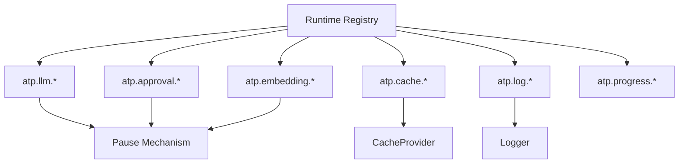
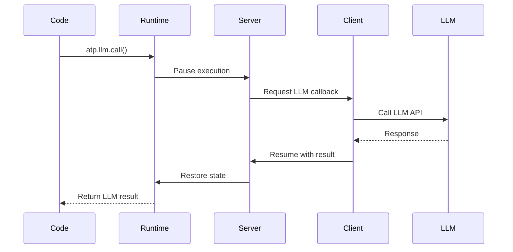

# @agent-tool-protocol/runtime

Runtime APIs available to agents during code execution (LLM, embedding, approval, cache, logging, progress).

## Overview

This package provides the `atp.*` runtime APIs that agents can use when executing code on ATP servers. These APIs enable LLM calls, embeddings, approvals, caching, logging, and progress reporting.

## Installation

```bash
npm install @agent-tool-protocol/runtime
```

## Architecture



## Runtime APIs

### atp.llm.\*

LLM operations that pause execution and route to client-provided LLM.

```typescript
// Simple LLM call
const response = await atp.llm.call({
	prompt: 'What is the capital of France?',
	model: 'gpt-4',
	temperature: 0.7,
	systemPrompt: 'You are a helpful assistant',
});

// Extract structured data
const user = await atp.llm.extract({
	prompt: 'Extract user info: John Doe, john@example.com',
	schema: {
		type: 'object',
		properties: {
			name: { type: 'string' },
			email: { type: 'string' },
		},
		required: ['name', 'email'],
	},
});
// Returns: { name: 'John Doe', email: 'john@example.com' }

// Classify text
const category = await atp.llm.classify({
	text: 'This product is amazing!',
	categories: ['positive', 'negative', 'neutral'],
});
// Returns: 'positive'
```

### atp.embedding.\*

Embedding operations for semantic search.

```typescript
// Generate and store embedding
const embeddingId = await atp.embedding.embed('Important document content');

// Search by similarity
const results = await atp.embedding.search('find similar documents', {
	topK: 5,
	minSimilarity: 0.7,
});
// Returns: [{ id: string, text: string, similarity: number }, ...]

// Calculate similarity between two embeddings
const similarity = await atp.embedding.similarity(vec1, vec2);

// Get all embeddings
const all = await atp.embedding.getAll();

// Count embeddings
const count = await atp.embedding.count();

// Clear all embeddings
await atp.embedding.clear();
```

### atp.approval.\*

Request human approval during execution.

```typescript
// Request approval
const result = await atp.approval.request('Delete all user data?', {
	critical: true,
	affectedUsers: 150,
});

if (result.approved) {
	// User approved, proceed
	await deleteData();
} else {
	// User denied
	return { cancelled: true, reason: result.response };
}
```

### atp.cache.\*

Cache data with TTL support.

```typescript
// Set cache value
await atp.cache.set('user:123', userData, 3600); // TTL in seconds

// Get cache value
const cached = await atp.cache.get('user:123');

// Check if key exists
const exists = await atp.cache.has('user:123');

// Delete cache key
await atp.cache.delete('user:123');
```

### atp.log.\*

Structured logging with multiple levels.

```typescript
// Log levels
atp.log.trace('Detailed trace', { requestId: '123' });
atp.log.debug('Debug info', { state });
atp.log.info('User logged in', { userId: '456' });
atp.log.warn('Deprecated API used', { api: 'v1' });
atp.log.error('Failed to connect', { error, retries: 3 });
atp.log.fatal('System crash', { reason });

// Logs include context automatically:
// - executionId
// - timestamp
// - level
// - message
// - metadata
```

### atp.progress.\*

Report progress for long-running operations.

```typescript
// Report progress
atp.progress.report({
	current: 5,
	total: 10,
	message: 'Processing items...',
	metadata: {
		itemsPerSecond: 2.5,
	},
});

// Progress updates are sent to client in real-time
```

## Usage in Agent Code

When agents execute code on ATP server, these APIs are automatically available:

```typescript
// Agent-generated code
const items = ['apple', 'banana', 'cherry', 'date', 'elderberry'];
const results = [];

atp.log.info('Starting fruit analysis', { count: items.length });

for (let i = 0; i < items.length; i++) {
	atp.progress.report({
		current: i + 1,
		total: items.length,
		message: `Processing ${items[i]}`,
	});

	// Call LLM for each item
	const analysis = await atp.llm.call({
		prompt: `Analyze this fruit: ${items[i]}`,
	});

	// Store embedding for semantic search
	const embeddingId = await atp.embedding.embed(analysis);

	// Cache result
	await atp.cache.set(`analysis:${items[i]}`, analysis, 3600);

	results.push({ fruit: items[i], analysis, embeddingId });
}

// Request approval before returning
const approval = await atp.approval.request('Analysis complete. Proceed with storage?', {
	resultCount: results.length,
});

if (!approval.approved) {
	atp.log.warn('User rejected storage');
	return { cancelled: true };
}

atp.log.info('Analysis complete', { results: results.length });
return results;
```

## Pause/Resume Mechanism



## Initialization

Runtime APIs are automatically initialized by the ATP server. For standalone use:

```typescript
import {
	setClientLLMCallback,
	initializeCache,
	initializeApproval,
	initializeVectorStore,
	initializeLogger,
} from '@agent-tool-protocol/runtime';

// Setup LLM callback
setClientLLMCallback({
	call: async (prompt, options) => {
		// Implement LLM call
	},
});

// Setup cache
initializeCache(cacheProvider);

// Setup approval
initializeApproval({
	request: async (message, context) => {
		// Implement approval
	},
});

// Setup embeddings
initializeVectorStore(embeddingHandler);

// Setup logger
initializeLogger({
	level: 'info',
	pretty: true,
});
```

## Replay Mode

For deterministic execution and testing:

```typescript
import { setReplayMode } from '@agent-tool-protocol/runtime';

// Enable replay mode with cached results
setReplayMode(true);

// LLM calls will return cached results instead of pausing
const result = await atp.llm.call({ prompt: 'Hello' });
// Returns cached response from previous execution
```

## Type Definitions

The runtime exports TypeScript definitions for all APIs:

```typescript
import type {
	LLMCallOptions,
	LLMExtractOptions,
	LLMClassifyOptions,
	EmbeddingSearchOptions,
	EmbeddingSearchResult,
	ApprovalRequest,
	ApprovalResponse,
	ProgressUpdate,
} from '@agent-tool-protocol/runtime';
```

## Metadata Generation

Runtime APIs are decorated with metadata for automatic discovery:

```typescript
import { GENERATED_METADATA } from '@agent-tool-protocol/runtime';

// Metadata includes:
// - API names and descriptions
// - Method signatures
// - Parameter types
// - Return types

console.log(GENERATED_METADATA);
// {
//   apis: [
//     {
//       name: 'llm',
//       description: 'LLM API - Large Language Model calls...',
//       methods: [...]
//     },
//     ...
//   ]
// }
```

## Error Handling

```typescript
import { PauseExecutionError, isPauseError } from '@agent-tool-protocol/runtime';

try {
	const result = await atp.llm.call({ prompt: 'Hello' });
} catch (error) {
	if (isPauseError(error)) {
		// Execution paused for callback
		console.log('Paused for:', error.callbackType);
	} else {
		// Other error
		throw error;
	}
}
```

## Advanced Features

### Sequence Numbers

Track call order for replay:

```typescript
import { getCallSequenceNumber } from '@agent-tool-protocol/runtime';

const seq = getCallSequenceNumber();
console.log('Current sequence:', seq);
```

### Execution Context

Run code in specific execution context:

```typescript
import { runInExecutionContext } from '@agent-tool-protocol/runtime';

runInExecutionContext('exec-123', () => {
	// All atp.* calls use this execution ID
	const result = await atp.llm.call({ prompt: 'Hello' });
});
```

## TypeScript Support

Full TypeScript definitions with strict typing.

## License

MIT
