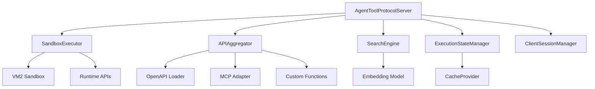
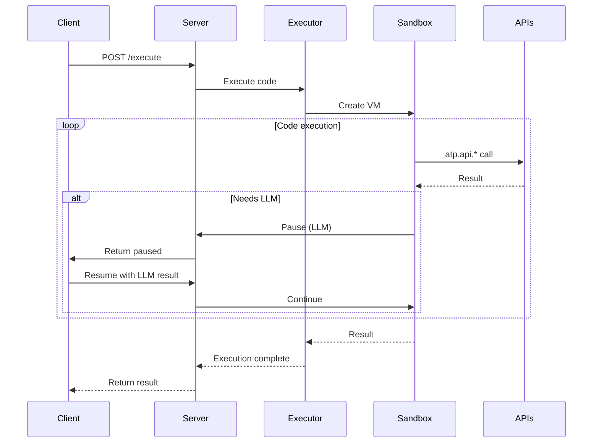

# @mondaydotcomorg/atp-server

Production-ready ATP server with sandboxed execution, API aggregation, semantic search, and state management.

## Overview

The ATP server provides secure, sandboxed TypeScript execution with built-in runtime APIs, OpenAPI integration, MCP support, semantic search, and comprehensive observability.

## Installation

```bash
npm install @mondaydotcomorg/atp-server
```

## Architecture



## Quick Start

### Basic Server

```typescript
import { createServer } from '@mondaydotcomorg/atp-server';

const server = createServer({
	execution: {
		timeout: 30000,
		memory: 128 * 1024 * 1024, // 128MB
	},
});

await server.start(3333);
console.log('ATP server running on http://localhost:3333');
```

### With OpenAPI Integration

```typescript
import { createServer, loadOpenAPI } from '@mondaydotcomorg/atp-server';

const server = createServer();

// Load OpenAPI specs
const githubAPI = await loadOpenAPI({
	url: 'https://api.github.com/openapi.json',
	name: 'github',
	auth: {
		type: 'bearer',
		token: process.env.GITHUB_TOKEN,
	},
});

server.addAPIGroup(githubAPI);

await server.start(3333);

// Agents can now use:
// await atp.api.github.repos.get({ owner: 'user', repo: 'repo' })
```

### With MCP Support

```typescript
import { MCPConnector } from '@mondaydotcomorg/atp-mcp-adapter';

const mcpConnector = new MCPConnector();

const filesystemAPI = await mcpConnector.connectToMCPServer({
	name: 'filesystem',
	command: 'npx',
	args: ['-y', '@modelcontextprotocol/server-filesystem', '/path/to/files'],
});

server.addAPIGroup(filesystemAPI);

// Agents can now use MCP tools:
// await atp.api.filesystem.read_file({ path: 'README.md' })
```

### With Semantic Search

```typescript
import { OpenAIEmbeddings } from '@langchain/openai';

const embeddings = new OpenAIEmbeddings();

const server = createServer({
	discovery: {
		embeddings, // Enable semantic search
	},
});

// Clients can search APIs semantically:
// client.searchQuery('How do I create a user?')
```

### With Redis Cache

```typescript
import { RedisCache } from '@mondaydotcomorg/atp-providers';
import Redis from 'ioredis';

const redis = new Redis(process.env.REDIS_URL);

const server = createServer({
	executionState: {
		ttl: 3600, // 1 hour
	},
});

server.setCacheProvider(
	new RedisCache({
		redis,
		keyPrefix: 'atp:',
		defaultTTL: 3600,
	})
);

await server.start(3333);
```

### With Provenance Security

```typescript
import {
	ProvenanceMode,
	preventDataExfiltration,
	requireUserOrigin,
} from '@mondaydotcomorg/atp-server';

const server = createServer({
	execution: {
		provenanceMode: ProvenanceMode.PROXY, // or AST
		securityPolicies: [preventDataExfiltration, requireUserOrigin],
	},
});
```

### With Audit Logging

```typescript
import { JSONLAuditSink } from '@mondaydotcomorg/atp-providers';

const server = createServer({
	audit: {
		enabled: true,
		sinks: [
			new JSONLAuditSink({
				path: './audit-logs',
				rotateDaily: true,
			}),
		],
	},
});

// All execution, tool calls, LLM calls are logged
```

### With OpenTelemetry

```typescript
const server = createServer({
	otel: {
		enabled: true,
		serviceName: 'my-atp-server',
		traceEndpoint: 'http://localhost:4318/v1/traces',
		metricsEndpoint: 'http://localhost:4318/v1/metrics',
	},
});

// Traces and metrics exported to OTLP collector
```

## Custom APIs

### Add Custom Functions

```typescript
server.addAPIGroup({
	name: 'database',
	type: 'custom',
	description: 'Database operations',
	functions: [
		{
			name: 'createUser',
			description: 'Create a new user',
			inputSchema: {
				type: 'object',
				properties: {
					name: { type: 'string' },
					email: { type: 'string' },
				},
				required: ['name', 'email'],
			},
			handler: async (input) => {
				const user = await db.users.create(input);
				return user;
			},
		},
	],
});

// Agents can use:
// await atp.api.database.createUser({ name: 'Alice', email: 'alice@example.com' })
```

### OAuth Integration

```typescript
import { GoogleOAuthProvider } from '@mondaydotcomorg/atp-providers';

const oauthProvider = new GoogleOAuthProvider({
	clientId: process.env.GOOGLE_CLIENT_ID,
	clientSecret: process.env.GOOGLE_CLIENT_SECRET,
	redirectUri: 'http://localhost:3333/oauth/callback',
	scopes: ['https://www.googleapis.com/auth/userinfo.email'],
});

server.addAPIGroup({
	name: 'gmail',
	type: 'oauth',
	oauthProvider,
	functions: [
		{
			name: 'sendEmail',
			description: 'Send email via Gmail',
			inputSchema: {
				/* ... */
			},
			handler: async (input, credentials) => {
				// Use credentials.accessToken
				return await sendGmailEmail(input, credentials.accessToken);
			},
		},
	],
});
```

## Configuration

```typescript
interface ServerConfig {
	execution?: {
		timeout?: number; // Default: 30000ms
		memory?: number; // Default: 128MB
		llmCalls?: number; // Max LLM calls per execution
		provenanceMode?: ProvenanceMode; // Default: 'none'
		securityPolicies?: SecurityPolicy[];
	};

	clientInit?: {
		tokenTTL?: number; // Default: 1 hour
		tokenRotation?: number; // Default: 30 minutes
	};

	executionState?: {
		ttl?: number; // State TTL in seconds
		maxPauseDuration?: number; // Max pause duration
	};

	discovery?: {
		embeddings?: Embeddings; // Enable semantic search
	};

	audit?: {
		enabled?: boolean;
		sinks?: AuditSink[];
	};

	otel?: {
		enabled?: boolean;
		serviceName?: string;
		traceEndpoint?: string;
		metricsEndpoint?: string;
	};
}
```

## API Groups

```typescript
interface APIGroupConfig {
	name: string;
	type: 'openapi' | 'custom' | 'mcp' | 'oauth';
	description?: string;
	baseUrl?: string;
	auth?: AuthConfig;
	functions: CustomFunctionDef[];
	oauthProvider?: OAuthProvider;
}
```

## Runtime APIs Available to Agents

Agents executing code have access to these runtime APIs:

### atp.llm.\*

```typescript
// LLM calls (requires client.provideLLM())
await atp.llm.call({ prompt: 'Hello' });
await atp.llm.extract({ prompt: 'Extract', schema: { name: 'string' } });
await atp.llm.classify({ text: 'Text', categories: ['A', 'B'] });
```

### atp.approval.\*

```typescript
// Approval requests (requires client.provideApproval())
const result = await atp.approval.request('Delete files?', { critical: true });
if (result.approved) {
	// Proceed
}
```

### atp.embedding.\*

```typescript
// Embeddings (requires client.provideEmbedding())
const id = await atp.embedding.embed('Store this text');
const results = await atp.embedding.search('query', { topK: 5 });
```

### atp.log.\*

```typescript
// Logging
atp.log.info('Processing user request');
atp.log.error('Failed to connect', { error });
atp.log.debug('Debug info', { data });
```

### atp.progress.\*

```typescript
// Progress reporting
atp.progress.report({ current: 5, total: 10, message: 'Processing...' });
```

### atp.cache.\*

```typescript
// Caching (requires cache provider)
await atp.cache.set('key', value, 3600);
const cached = await atp.cache.get('key');
```

### atp.api.\*

```typescript
// Dynamic API calls based on loaded API groups
await atp.api.github.repos.get({ owner: 'user', repo: 'repo' });
await atp.api.database.createUser({ name: 'Alice' });
```

## Middleware

```typescript
import type { Middleware, RequestContext } from '@mondaydotcomorg/atp-server';

const loggingMiddleware: Middleware = async (context: RequestContext, next) => {
	console.log(`${context.method} ${context.path}`);
	const start = Date.now();

	await next();

	console.log(`Completed in ${Date.now() - start}ms`);
};

server.use(loggingMiddleware);
```

## Server Lifecycle

```typescript
const server = createServer(config);

// Setup
server.setCacheProvider(cache);
server.setAuthProvider(auth);
server.addAPIGroup(apiGroup);
server.use(middleware);

// Start
await server.start(3333);

// Shutdown
await server.shutdown();
```

## Execution Flow



## Production Deployment

### With Redis + PostgreSQL

```typescript
import { RedisCache } from '@mondaydotcomorg/atp-providers';
import { PostgresSaver } from '@langchain/langgraph-checkpoint-postgres';
import Redis from 'ioredis';

const redis = new Redis(process.env.REDIS_URL);
const cache = new RedisCache({ redis });

const server = createServer({
	execution: {
		timeout: 60000,
		memory: 256 * 1024 * 1024,
	},
	executionState: {
		ttl: 7200, // 2 hours
	},
	audit: {
		enabled: true,
	},
	otel: {
		enabled: true,
	},
});

server.setCacheProvider(cache);

await server.start(process.env.PORT || 3333);
```

## Security Best Practices

1. **Use provenance mode** for sensitive data
2. **Set execution limits** (timeout, memory, LLM calls)
3. **Enable audit logging** for compliance
4. **Use OAuth** for third-party APIs
5. **Validate API inputs** with schemas
6. **Use security policies** to block malicious patterns

## TypeScript Support

Full TypeScript definitions included.

## License

MIT
